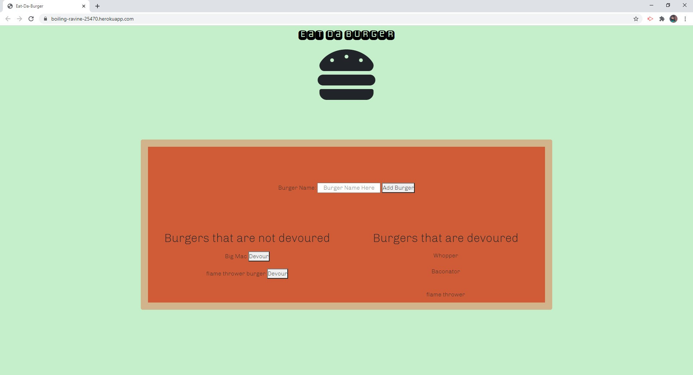

# Eat-Da-Burger

[Heroku App](https://boiling-ravine-25470.herokuapp.com/)

## Description

Eat-Da-Burger is a CRUD application using HTML/CSS as the front end which is templated through Handlebars. It also uses MYSQL to store data to the database which can then be uploaded to Heroku using JawsDB. Users can add any burger they want to the burgers that are available to be devoured. They can also click the devour button to devour the burger which will move it to the devoured list.

## License:

## Contributions:

Right now I am the only one who has contributed, if you would like to then send a pull request and I will review it.

## Test:

No testing.

## Questions

For more information you can visit my [Github](https://github.com/grantscriver)
If you have any additional questions you can email me at: Grantscriver@gmail.com
